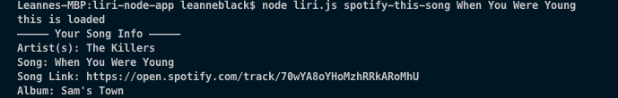
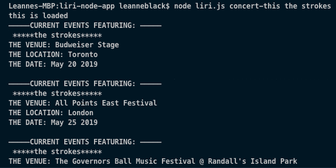
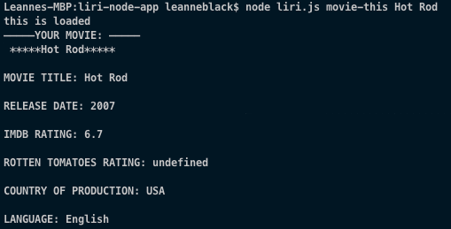

# liri-node-app

## Bootcamp HW

### About The Assignment

In this assignment, we were asked to create a LIRI command line node app, sorta like SIRI! This LIRI takes in the following commands:

- "spotify-this-song"
  \*ex: spotify-this-song When You Were Young
  - 
- "concert-this"
  \*ex: concert-this The Strokes
  - 
- "movie-this"
  \*ex: movie-this Hot Rod
  - 

and gives you back corresponding data about the user's input.
